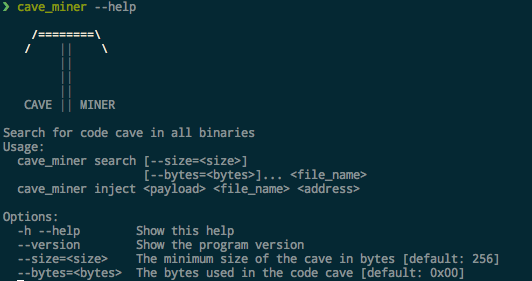
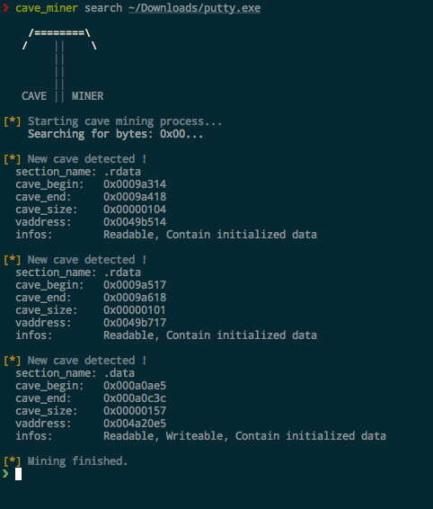

# CAVE MINER
This tools search for code cave in binaries (Elf, Mach-o, Pe), and inject code in them.

### Installation
/!\ Only work in python2.x /!\

```bash
pip install cave-miner
```

### Usage



### Exemple


